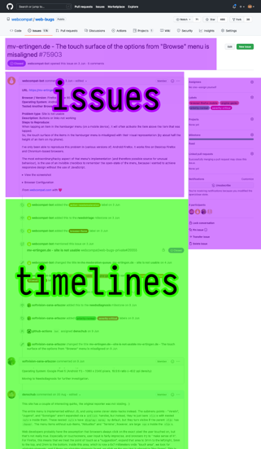

# Available Data

Each issue has two JSON files, and thus has data in two ElasticSearch indices:

- `issue.json` and the `issues` index in ElasticSearch: Contains the _current_ state of the issue and includes: The initial issue description, and information about the current labels, etc. The data stored is [the values returned by GitHub's Issue API](https://docs.github.com/en/rest/reference/issues#get-an-issue). The following screenshot highlights that data in Purple.
- `timeline.json` and the `timelines` index in ElasticSearch: Everything "below" the initial issue description: changes to labels, milestones, as well as comments and references issues. The data stored is an array of timeline events, [the values for each event are documented in GitHub's API documentation](https://docs.github.com/en/developers/webhooks-and-events/events/issue-event-types). The following screenshot highlights that data in Green.

## When to use what

In general, if your question contains a "currently", for example "which issues do currently have the `browser-firefox` label assigned", then you can answer that question using the `issues` index. Contrary, if your question contains "at any point in time", for example, "which issues were, at any point in time, assigned the `needsdiagnosis`" milestone, then you should look at the `timelines` index.

There is no direct link between the two datasets. However, each entry in `issues` has a `bug_number` field, which corresponds to the issue number on GitHub. Also, all `timeline` events have a `bug_number` as well, so you can use that field to query and correlate data.

## A note about non-public data

The data archive, and the indices, contain details about web-bugs that a) have not yet been moderated, or b) have been automatically rejected by the BugBug bot. That information is not shown publicly on GitHub, because it may contain personal information or other unwanted content. This is also the reason why the `/data/` access requires HTTP authentication, and why Kibana has no public access mode.

Issues that contain data from unmoderated/automoderated issues have a boolean field `__WEBCOMPAT_PRIVATE_ISSUE__`, set to `true`, in their `issues` data. If you're building a dashboard for public view which allows looking at individual issue datasets, make sure to exclude issues with this flag set.
